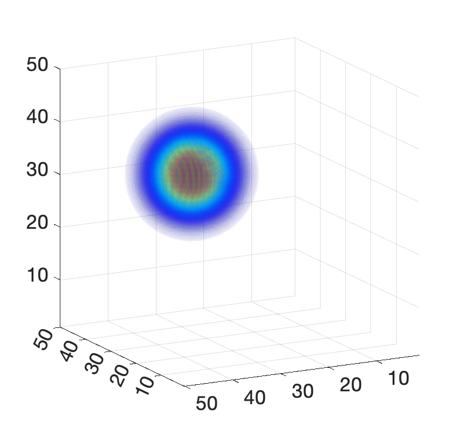
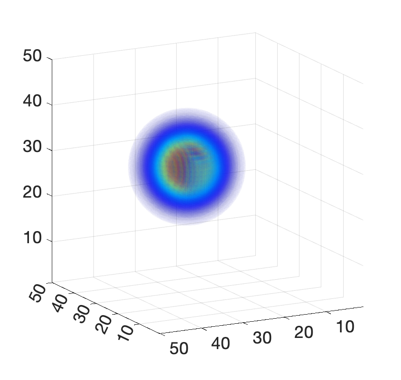
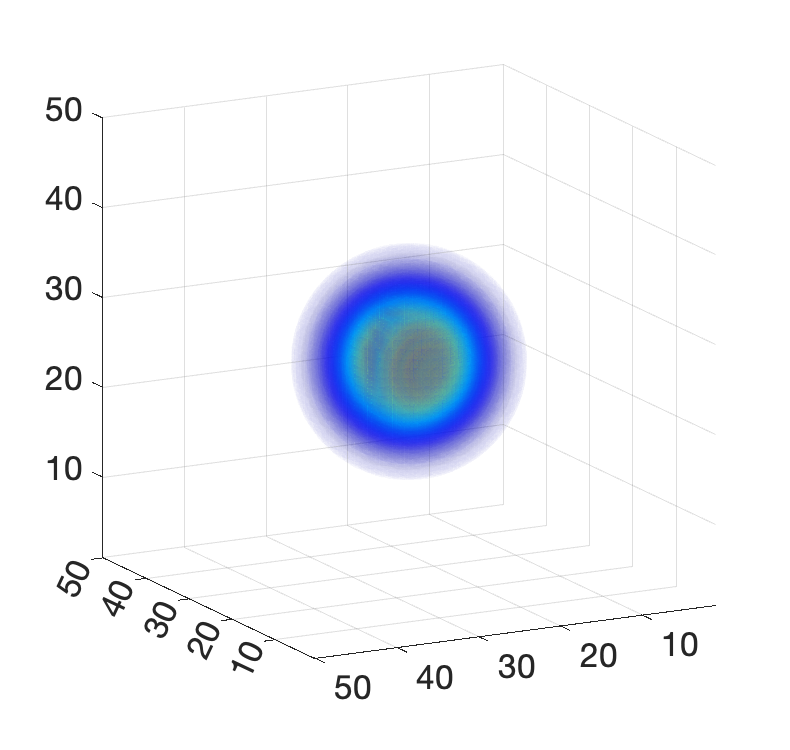
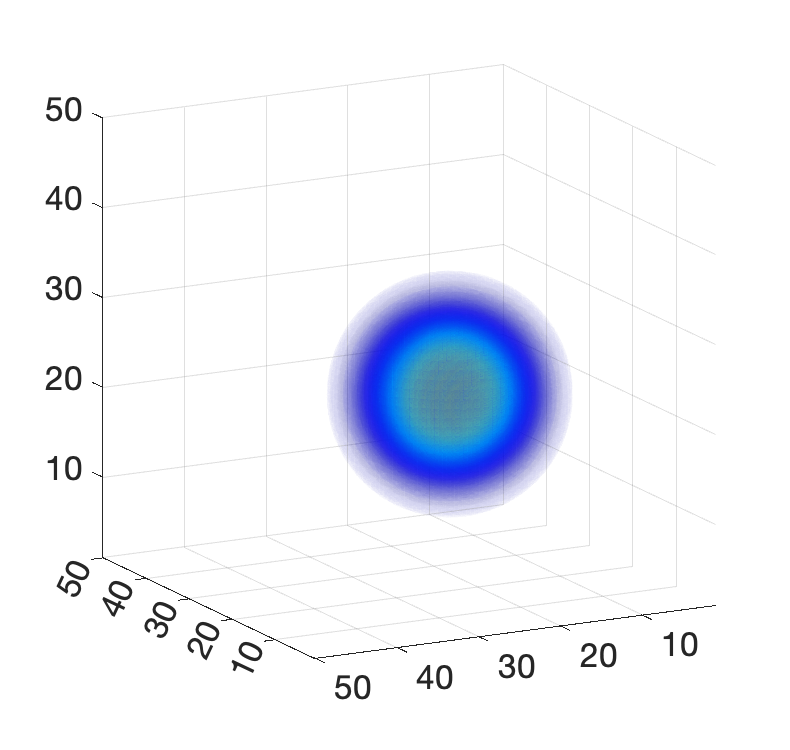
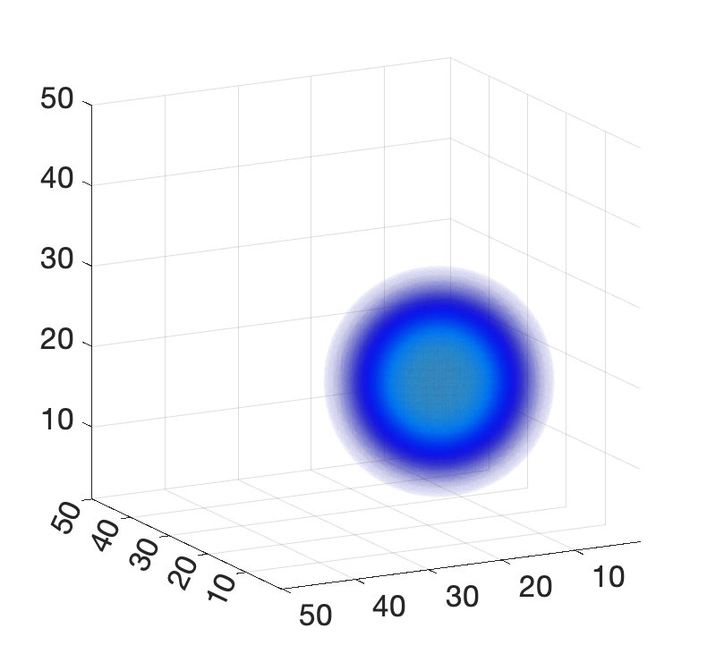
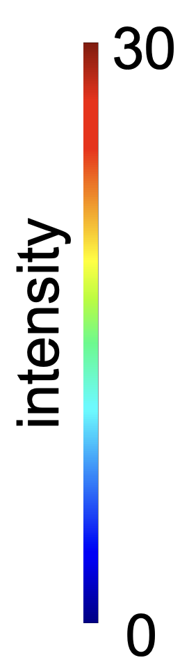

# urOMT (unbalanced regularized optimal mass transport)

## Introduction

This project works on an unbalanced version of regularized optimal mass transport (urOMT) problem by adding a new relative source variable and its indicator function into the formulation. Specaifically, we deal with a problem as follows:

Given the initial mass distribution function $\rho_0(x)\geqslant0$ and the final one $\rho_1(x)\geqslant0$ defined on a bounded region $\Omega\subseteq\mathbb{R}^3$, one solves

$$\underset{\rho,v,r}{\text{min}}\quad \int_0^T\int_{\Omega}\big(\left\lVert v(t,x)\right\rVert^2\rho(t,x) + \alpha \chi(t,x)r(t,x)^2\rho(t,x)\big)dx dt $$
subject to

$$\frac{\partial\rho}{\partial t} + \nabla\cdot(\rho v) = \sigma\Delta\rho + \chi\rho r, $$

$$\rho(0,x) = \rho_0(x), \quad\rho(T,x) = \rho_1(x)$$

where a temporal dimension $t\in[0,T]$ is added to the transport process. In the above expression, $\rho(t,x)$ is the dynamic density function; $v(t,x)$ is the velocity field defining the flow from $\rho_0$ to $\rho_1$; $r(t,x)$ is the relative source variable; $\chi(t,x)$ is the given indicator function of $r(t,x)$ which takes values either 0 or 1 to constrain $r$ to a certain spatial and temporal location; constant $\sigma>0$ is the diffusion coefficient; $\alpha>0$ is the weighting parameter of the source term in the cost functional.

This work can be considered as the extension of the regularized optimal mass transport (rOMT) problem with code available at https://github.com/xinan-nancy-chen/rOMT and https://github.com/xinan-nancy-chen/rOMT_spdup and with papers available at

> -- <cite>[Visualizing fluid flows via regularized optimal mass transport with applications to neuroscience][1]</cite>,

> -- <cite>[Cerebral amyloid angiopathy is associated with glymphatic transport reduction and time-delayed solute drainage along the neck arteries][2]</cite>.

The numerical method of current urOMT problem is described in 

> -- <cite>[Unbalanced Regularized Optimal Mass Transport with Applications to Fluid Flows in the Brain][3]</cite>.

[1]: https://arxiv.org/abs/2201.07307
[2]: https://www.nature.com/articles/s43587-022-00181-4
[3]: https://arxiv.org/abs/2301.11228

Contact Xinan Chen at chenx7@mskcc.org for questions.

## Sample cases for demonstration

### (A) Gaussian Spheres

We created five successive Gaussian-based spheres to test our urOMT algorihtm on. One can go to script ``create_gaussian.m`` to check how we created the synthetic data if interested. The five input images are plotted in 3D rendering as follows:

